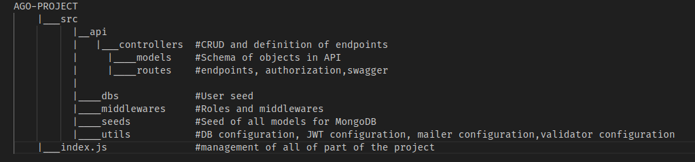
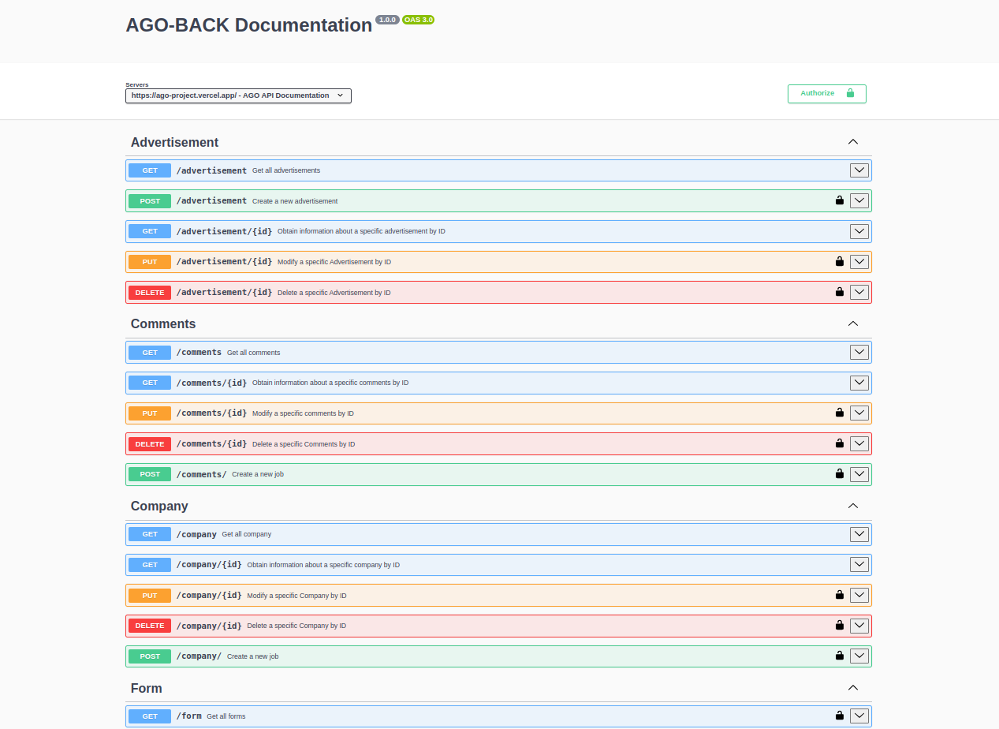
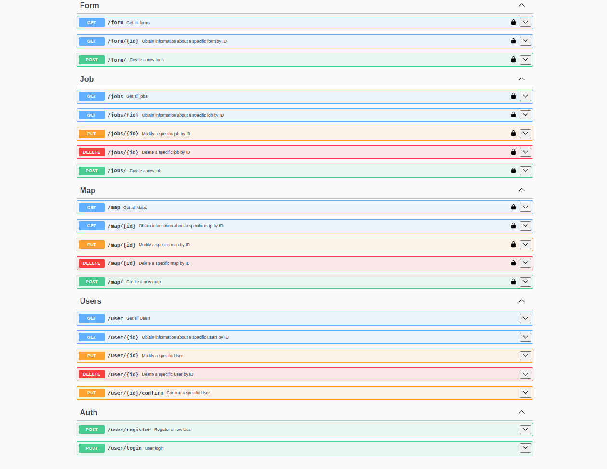
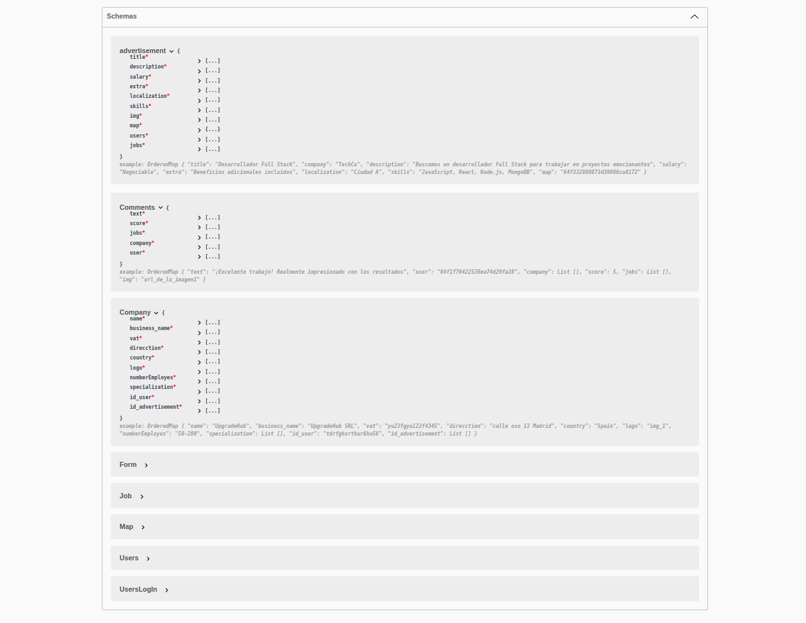
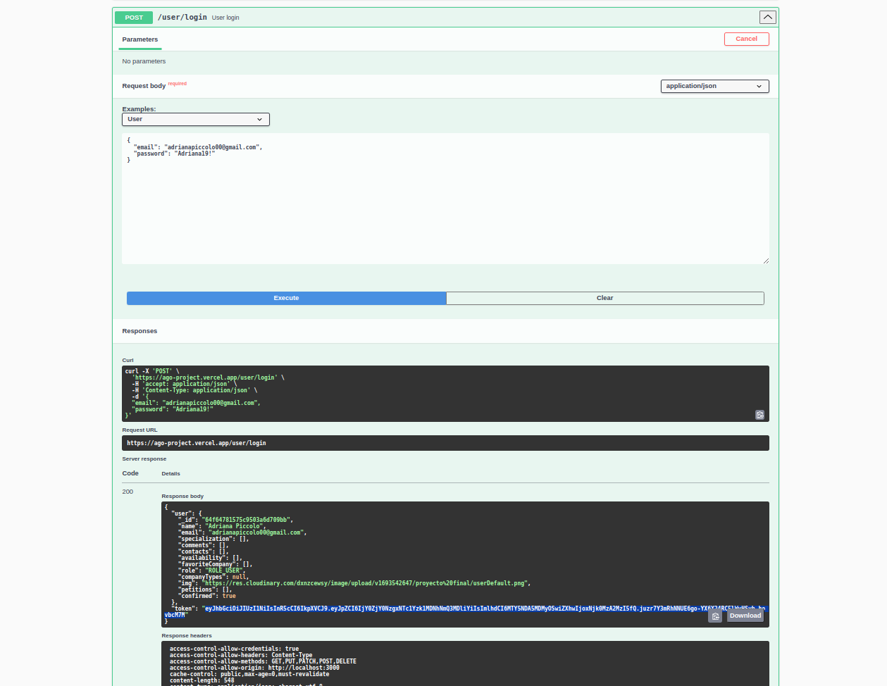
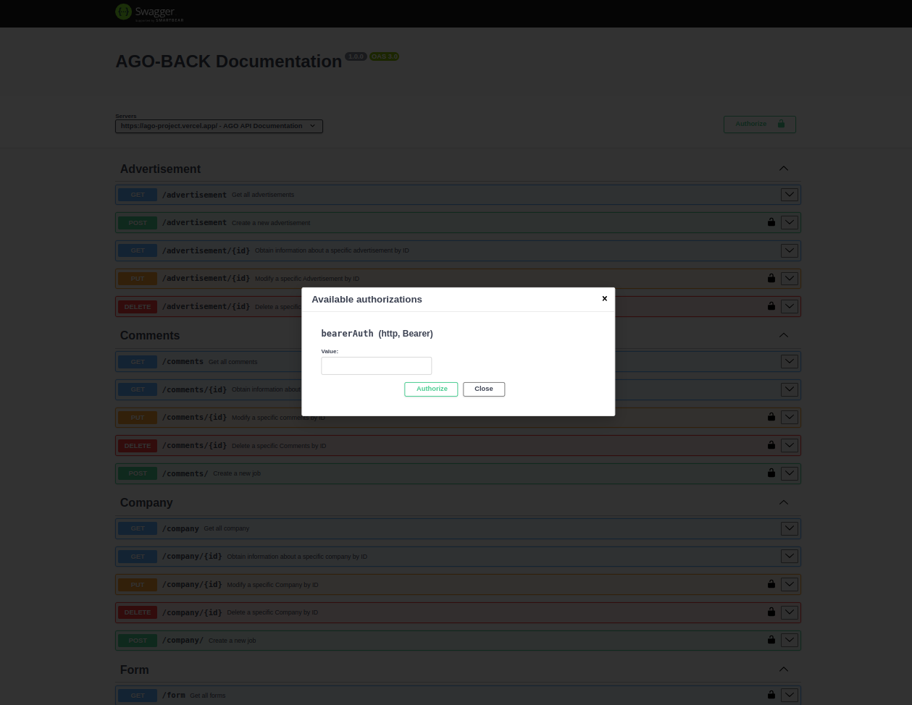
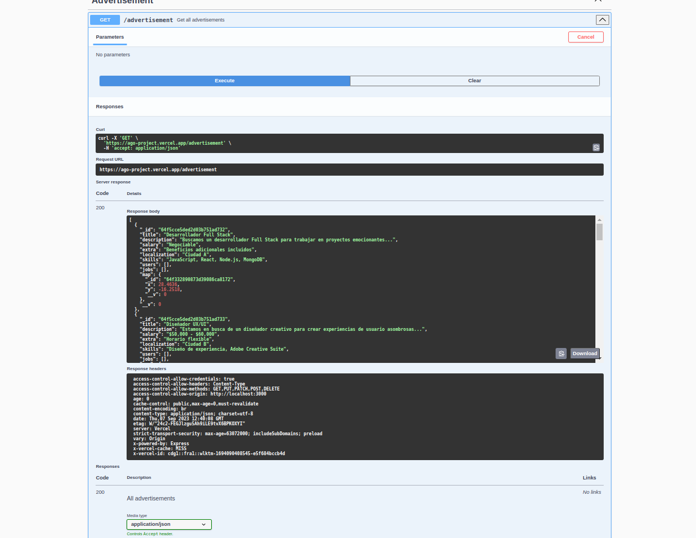

# Gym-web-back

Structure of API with Express.js and documentation with Swagger.

## Project structure

## Installation

- Clone this repository: 

        git clone git@github.com:AdrianaP00/AGO-project.git

- Inizialize the project: 

        npm install --save
        npm run start
        
- Go to the browser and use this URL for visualization of documentation: 

        https://ago-project.vercel.app/api-doc

## Images

### Start

### Schema

### Choose a role end take the token

### Put obtained token in Authorization 

